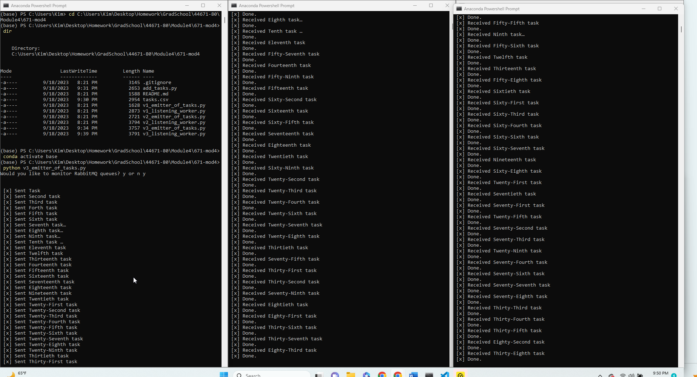

# RabbitMQ Work Queue Project

**Author:** Kim Leach
**Date:** September 18, 2023

## Overview

This project demonstrates a RabbitMQ-based work queue system where one process creates task messages, and multiple worker processes share the work. The workers process the tasks concurrently, making it an efficient way to distribute and process tasks in parallel.

## Before You Begin

To get started with this project, follow these steps:

1. Fork this starter repo into your GitHub account.

2. Clone your forked repository to your local machine.

3. Set up your Python environment:
   
   - Open your terminal or command prompt.
   - Use the View/Command Palette in your code editor to select the Python interpreter.
   - Choose your desired Conda environment.

## Read

Before diving into the code, it's helpful to understand the concepts and principles behind this project. Please read the following resources:

1. [RabbitMQ Tutorial - Work Queues](https://www.rabbitmq.com/tutorials/tutorial-two-python.html)

2. Carefully review the code and comments in this repository to understand how the RabbitMQ-based work queue system is implemented.

## RabbitMQ Admin

RabbitMQ comes with an admin panel that allows you to monitor queues and message processing. When you run the task emitter, you'll have the option to open the RabbitMQ admin panel. Python makes it easy to open a web page programmatically.

## Execute the Producer

To start creating and sending task messages to the RabbitMQ queue, follow these steps:

1. Run `v3_emitter_of_tasks.py` and respond with 'y' when prompted to monitor RabbitMQ queues.

You can now explore the RabbitMQ website to see the status of the queues.

## Execute a Consumer / Worker

To create and start a worker that will listen for and process task messages, follow these steps:

1. Run `v3_listener_of_tasks.py`.

You might be wondering if the worker will terminate on its own or how to know when it's finished.

## Ready for Work

Once you have a worker running, you can use the `v3_emitter_of_tasks.py` script to produce more task messages to be processed by the worker(s).

## Start Another Listening Worker

You can launch multiple workers to process tasks concurrently. Follow these steps:

1. Use the `v3_listener_of_tasks.py` script to launch a second worker.

Feel free to add multiple tasks, such as "First message," "Second message," and so on. Observe how the tasks are distributed among the workers. Monitor multiple terminal windows to see which worker processes which tasks.

## Reference

For more in-depth information on work queues and RabbitMQ, refer to the official RabbitMQ tutorial:

- [RabbitMQ Tutorial - Work Queues](https://www.rabbitmq.com/tutorials/tutorial-two-python.html)

## Screenshot

See the running example above with at least three concurrent process windows. This screenshot demonstrates the project in action with a producer and multiple workers efficiently processing tasks in parallel.
